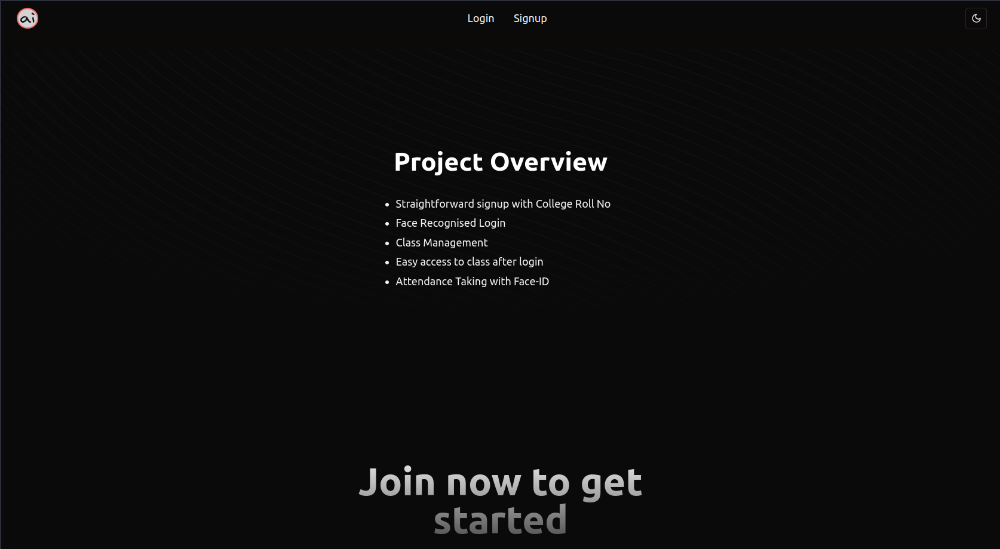
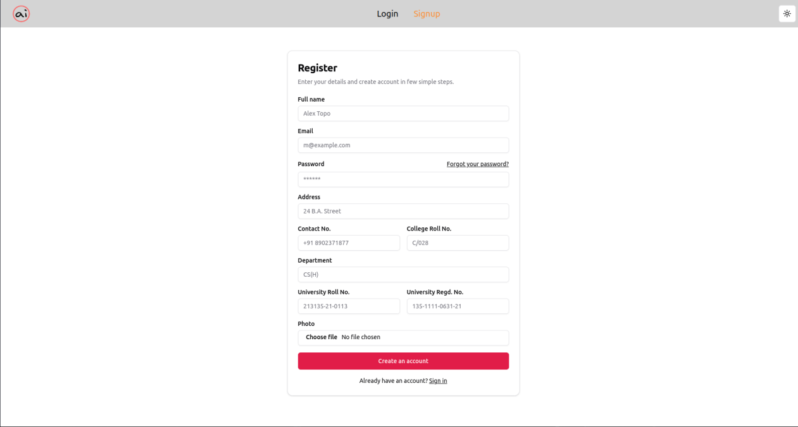
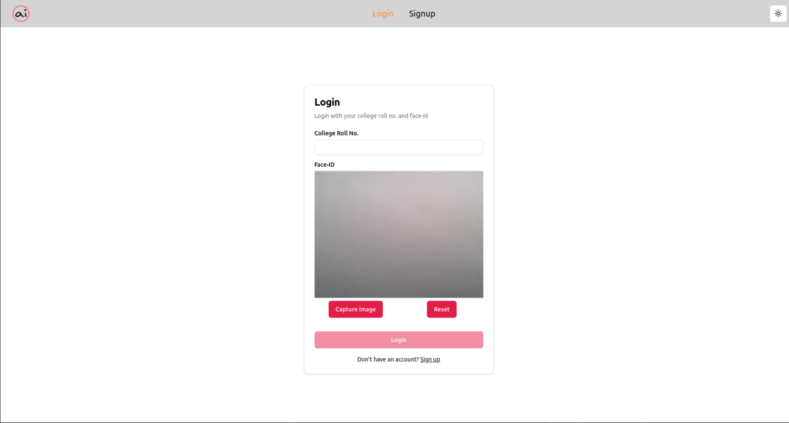
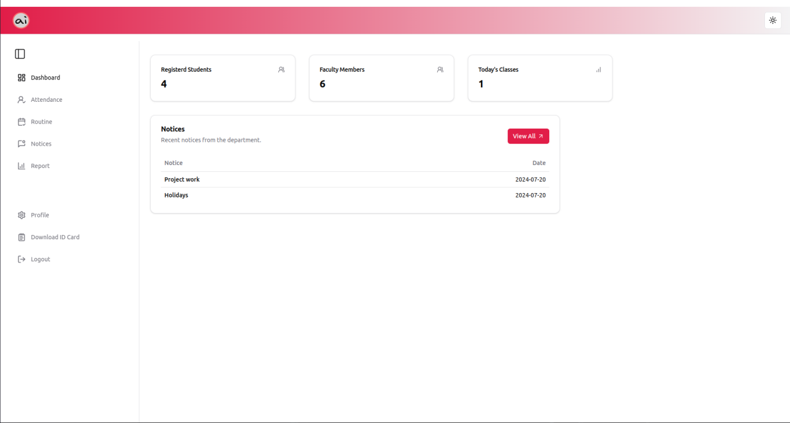
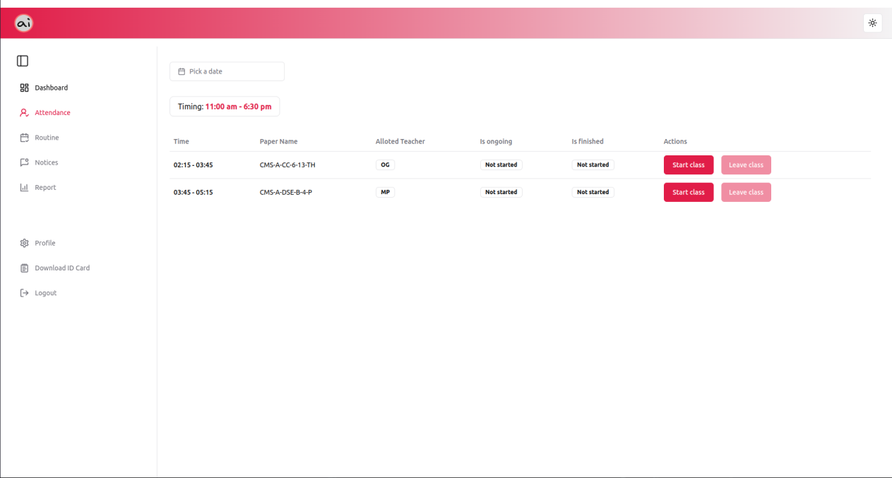
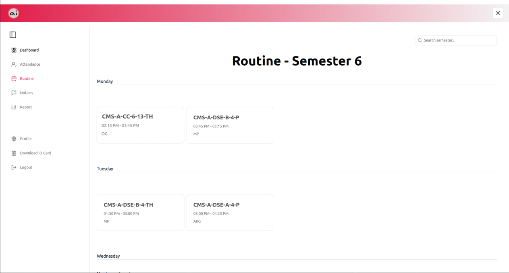
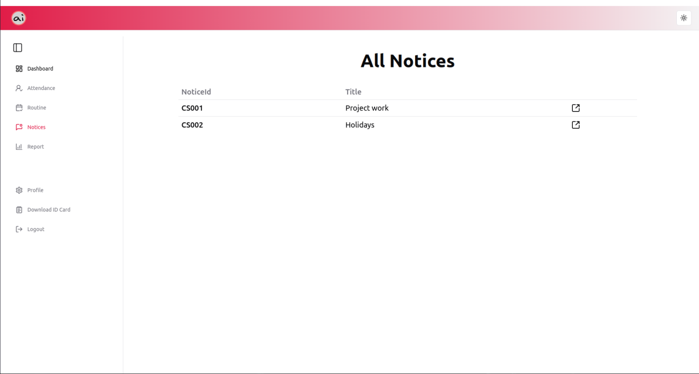

<h1 align="center">attendAI-frontend</h1>


## developed using

- Vite React
- Typescript
- Shadcn UI
- Acertenity UI
- Tailwindcss
- react-router-dom

## Requirements and Installation

To run this project, you need to have the following software installed on your computer:

- **Git**
- **Node.js**
- **npm** (comes with Node.js) or any other package manager like (bun, yarn, pnpm)
- The backend (server & database) needs to be up and running for fully functional of the frontend
  > backend setup instructions can be found [here](https://github.com/theonlysroy/attendAI-backend)

### Installation

- [Git](https://git-scm.com/downloads)
- [Node.js](https://nodejs.org/en/download/) (version 16.13.0 or higher)

## To run the project

- clone the repo or download the zip

```bash
git clone https://github.com/theonlysroy/attendAI-frontend.git
```

- navigate to the project folder

```bash
  cd attendAI-frontend
```

- run the following commands

```bash
npm install   # to install all the dependencies

npm run dev   # to start the project
```

- go to `https://localhost:5173` to view the project

## Screenshots
- Register Page
  

- Login Page
  

- Dashboard Page
  

- Attendance Page
  

- Routine Page
  

- Notices Page
